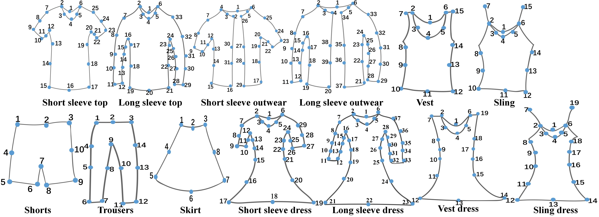

# Clothes-Recognition-and-Retrieval
Query by image on clothing retails.

# Project Proposal
[link](https://hackmd.io/ss4RX9l-SJanodhbGY6PeQ)

# Dataset
[link](https://drive.google.com/drive/u/1/folders/1dhQeqwmX97NfCM079KvZN1sBe-fs1nid)

# Cloth Detection
A [Yolo-v3](https://pjreddie.com/media/files/papers/YOLOv3.pdf) object detection network is trained to detect the clothes. 

The clothes consists of these classes:

The dataset used is the comprehensive fashion dataset [DeepFashion2](https://github.com/switchablenorms/DeepFashion2), it can be downloaded at their Git Hub page.

## Usage
1. Unzip Deep Fashion 2 dataset to `./cloth_segmentation/DeepFashion2`
2. Run `parse_json_to_yolo_format.py` to generate YOLO bounding box format (.txt)

