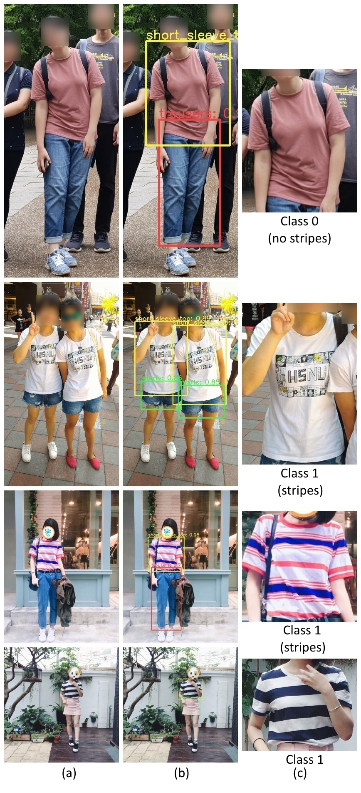

# Clothes-Recognition-and-Retrieval
Clothes recognition and retrieval on clothing retails. Please see [report](./Final_report.pdf) for more details.

### Result on real data


## Usage
### Required package
1. tensorflow (2.0.0a0), GPU version can also be used
2. opencv (4.1.0.25)

### Installation
```bash
pip install -r requirements.txt
```

### Reproduce results
1. Run `main.py` to produce final classification result
2. Run `cloth_detection.py` to produce images with clothes detection bounding boxes.

### Model weights
We trained a Yolo-v3 object detection on [DeepFashion2](https://github.com/switchablenorms/DeepFashion2) dataset, pre-trained model weights (tensorflow weights and darknet weights) can be download [here](https://drive.google.com/file/d/1DPydA0FpLYEHaFYDa8_oZAot_Ou5JefK/).

### Dataset
For the classifier, we use a relatively small dataset consists of only 46 clothes of 2 classes (clothes with stripes and clothes without stripes), the dataset can be download [here](https://drive.google.com/file/d/1oCMPB1MSsB3yJdOLm2iEZFGyYSKXQmIw/). 


## System pipeline


## References
1. Yannis Kalantidis, Lyndon Kennedy & Li-Jia Li. (2013) "Getting the Look: Clothing Recognition and Segmentation for Automatic Product Suggestions in Everyday Photos".

2. Yuying Ge, Ruimao Zhang, Lingyun Wu, Xiaogang Wang, Xiaoou Tang & Ping Luo. (2019) "DeepFashion2: A Versatile Benchmark for Detection, Pose Estimation, Segmentation and Re-Identification of Clothing Images".

3. Joseph Redmon & Ali Farhadi. (2018) "YOLOv3: An Incremental Improvement".